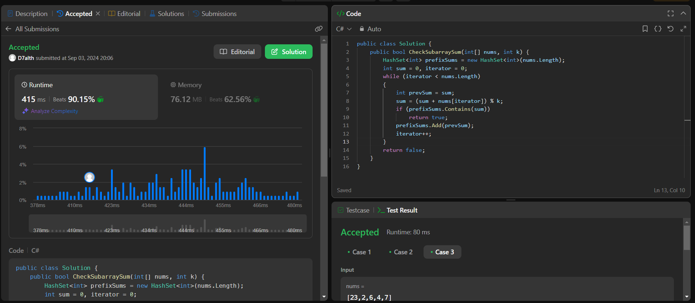

# Continuous Subarray Check

Este projeto contém uma implementação para verificar se existe uma subarray contínua cuja soma é um múltiplo de `k`. O projeto inclui a função principal, benchmarks para medir o desempenho e testes unitários para garantir a correção do algoritmo.

source: [LeetCode](https://leetcode.com/problems/continuous-subarray-sum/)

## Descrição do Algoritmo

### Como Funciona

O algoritmo verifica se existe uma subarray contínua em um array de números inteiros `nums` cuja soma é um múltiplo de `k`. Ele utiliza um `HashSet` para armazenar as somas prefixadas dos elementos do array.

**Passos do Algoritmo:**
1. **Inicialização:** Cria um `HashSet` para armazenar somas prefixadas e inicializa variáveis para a soma corrente e o índice do array.
2. **Iteração:** Percorre o array, atualizando a soma corrente e calculando o módulo da soma com `k`.
3. **Verificação:** Verifica se a soma corrente já foi vista antes. Se sim, isso significa que a diferença entre as somas prefixadas é um múltiplo de `k`, e portanto, existe uma subarray válida.
4. **Armazenamento:** Adiciona a soma prefixada anterior ao `HashSet`.
5. **Retorno:** Retorna `true` se encontrar uma subarray válida; caso contrário, retorna `false` ao final da iteração.

### Escolha do HashSet

O `HashSet` é utilizado para armazenar somas prefixadas porque ele oferece uma operação de verificação (`Contains`) com complexidade de tempo média de O(1). Isso é eficiente para verificar se uma soma prefixada já foi encontrada anteriormente, o que é crucial para o desempenho do algoritmo.

## Benchmarking

O projeto utiliza o [BenchmarkDotNet](https://benchmarkdotnet.org) para medir o desempenho do algoritmo. Três cenários de benchmark são fornecidos para avaliar a performance:

- **Benchmark1:** Verifica o array `[23, 2, 4, 6, 7]` com `k = 6`.
- **Benchmark2:** Verifica o array `[23, 2, 6, 4, 7]` com `k = 13`.
- **Benchmark3:** Verifica o array `[5, 0, 0, 0, 0]` com `k = 7`.

Para executar os benchmarks, use o comando:
```bash
dotnet run -c release --project .\core\continuous_subarray.core.csproj --filter *CheckSubarraySumBenchmark*
```
## Testes Unitários

Os testes unitários são escritos usando o [xUnit](https://xunit.net). Os casos de teste verificam diferentes combinações de arrays e valores de `k` para garantir a correção da função.

Para executar os testes, use o comando:

```bash
dotnet test
```
## Complexidade

- **Tempo:** O algoritmo possui complexidade de tempo O(n), onde `n` é o número de elementos no array. Isso ocorre porque cada elemento é processado uma vez e as operações no `HashSet` (inserção e verificação) têm complexidade média O(1).

- **Espaço:** A complexidade de espaço é O(n) devido ao armazenamento das somas prefixadas no `HashSet`.

## Porque mostrar o projeto?

Decidi mostrar este projeto porque ele é parte do meu workflow atual para a implementação desses desafios de programação. A implementação e os testes fornecem uma solução eficiente e bem testada para o problema de subarrays contínuas com múltiplos de `k`. 

Assim acerto com menos tentativas : )

## Resultado final
